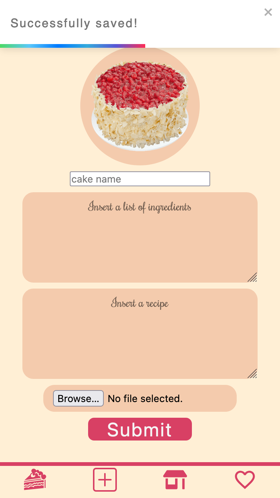

# CakeBox App Capstone project

Digitales Gesellenstück as final project for neuefische web dev bootcamp

## Description

CakeBox is an app built with the aim to store your favourite cake recipes in one place. The app gives the user the freedom to gather, save and store favourite recipes and also to get inspired by random dessert ideas from the world wide web.

### TechStack

HTML, CSS, JavaScript, React 16.8+, Vercel, Rest API;

### Images

